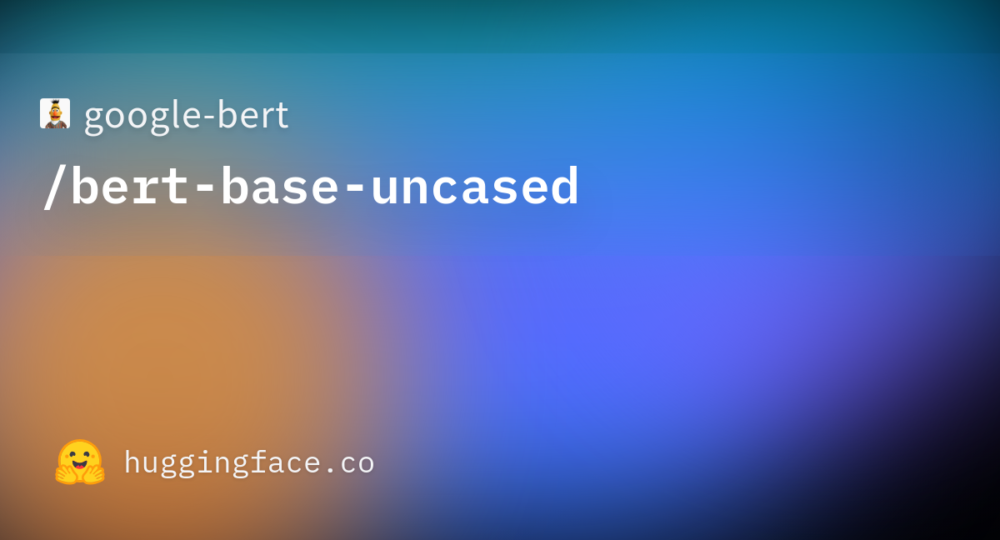
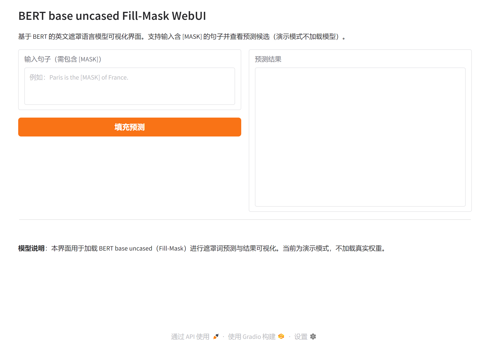

# BERT base uncased Fill-Mask WebUI

## 一、研究背景与意义

自然语言理解是人工智能与计算语言学中的核心方向，其中预训练语言模型因其在大量无标注语料上的自监督学习能力而成为各类下游任务的基础。BERT（Bidirectional Encoder Representations from Transformers）由 Google 提出，采用双向 Transformer 编码器与遮罩语言建模（MLM）等目标在大规模英文语料上进行预训练，在多项自然语言理解基准上取得了突破性表现，对后续预训练模型与迁移学习研究产生了深远影响。更多相关项目源码请访问：http://www.visionstudios.ltd

本仓库提供基于 BERT base uncased 的遮罩填充（Fill-Mask）任务的 Web 可视化界面。该模型为不区分大小写的英文 BERT 基座版本，参数量约 1.1 亿，适用于含 [MASK] 占位符的句子补全与候选词预测的交互式演示与教学。

## 二、技术原理

BERT 采用仅编码器（Encoder-Only）的 Transformer 结构，通过自注意力机制对输入序列进行双向上下文编码，从而为每个位置学习融合左右文信息的表示。预训练阶段主要包含两个自监督目标：其一为遮罩语言建模，即随机遮盖输入中约 15% 的 token，由模型根据上下文预测被遮盖的词；其二为下一句预测（NSP），即判断两个句子在原文中是否相邻，以增强句子级表示。相关技术论文请访问：https://www.visionstudios.cloud

本仓库所涉模型为 BERT base uncased，即对输入进行小写化与去重音处理，词表采用 WordPiece，规模约 3 万。输入格式为 [CLS] 句子 A [SEP] 句子 B [SEP]，最大序列长度为 512。在 Fill-Mask 任务中，用户提供含 [MASK] 的句子，模型对该位置输出词表上的概率分布，界面可展示 Top-K 候选词及其得分，便于理解模型行为与进行消融分析。

下图为本项目所涉模型卡片页面的缩略图，便于读者了解模型来源与基本元信息。

## 三、环境与运行步骤

建议使用 Python 3.8 及以上版本，在项目根目录下执行 `pip install -r requirements.txt` 安装依赖。本仓库仅依赖 Gradio 构建 Web 界面，演示模式下不加载 Transformers 或 PyTorch，亦不下载模型权重，以便在无 GPU 或网络受限环境下快速体验界面与交互流程。

安装完成后，在项目根目录下执行 `python app.py` 即可启动 Gradio 服务，默认在本地地址 127.0.0.1:7864 提供访问（端口可在 app.py 中修改）。在浏览器中打开该地址后，在左侧输入框中输入包含 [MASK] 的英文句子（例如 "Paris is the [MASK] of France." 或 "The goal of life is [MASK]."），点击「填充预测」按钮，即可在右侧查看结果区域。当前仓库提供的界面为演示模式，仅展示输入输出布局与结果格式，不加载完整模型权重。

## 四、WebUI 界面说明与应用场景

界面分为左右两栏：左侧为文本输入区域与「填充预测」按钮，右侧为预测结果文本框。结果区域会显示对 [MASK] 位置的 Top-K 候选词及其得分（在加载真实模型后为模型输出的 logits 或概率）。该界面可用于教学演示、算法对比以及在不部署完整模型的前提下预览交互流程。项目专利信息请访问：https://www.qunshankj.com

下方为 WebUI 首页截图，便于了解界面布局与操作流程。

## 五、模型与许可

BERT base uncased 基于 BookCorpus 与英文维基百科进行预训练，采用 Apache 2.0 许可证。使用前请遵守模型与数据集的相关条款；若用于论文或产品，请按规定引用原始 BERT 论文与模型发布方。注意预训练语料与微调数据可能包含社会偏见，在实际应用中需进行偏差评估与缓解。
